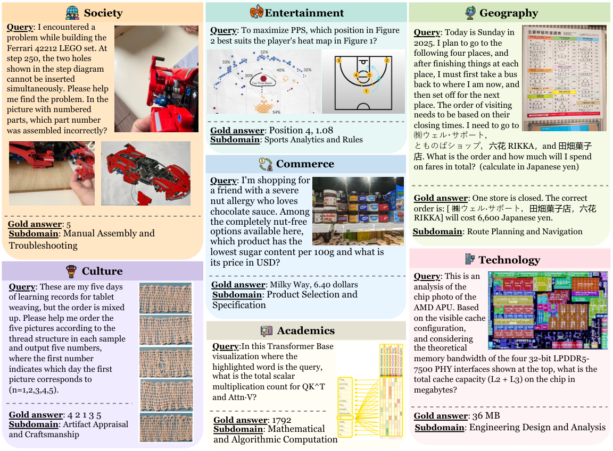

<div align="center">
  
  <h1 align="center">AgentVista: Evaluating Multimodal Agents in<br>Ultra-Challenging Realistic Visual Scenarios</h1>

  <a href="#">
    
  </a>
  <a href="https://github.com/hkust-nlp/AgentVista">
    
  </a>
  <a href="https://huggingface.co/datasets/Warrieryes/AgentVista">
    
  </a>
  <a href="https://agentvista-bench.github.io/">
    
  </a>
</div>

---

> *Real-world multimodal agents solve multi-step workflows grounded in visual evidence.*

**AgentVista** is the first benchmark that evaluates multimodal agents on realistic, ultra-challenging visual scenarios requiring long-horizon hybrid tool use. It spans **25 sub-domains** across **7 categories** with **209** expert-curated tasks. Even the best model, **Gemini-3-Pro**, achieves only **27.3%** overall accuracy. This repository provides a **lightweight yet general agent framework** for reproducible evaluation.


<div align="center">
  
  <br>
  <em>Sampled AgentVista examples from each domain. Each query is grounded in complex, real-world visual scenes and is designed to elicit agentic tool use with multi-step reasoning toward a unique, verifiable answer.</em>
</div>

---

## News

- **[2026/02]** AgentVista benchmark, evaluation codebase, and dataset are publicly released.

---

## What is AgentVista?

AgentVista is a benchmark designed to evaluate generalist multimodal agents on **diverse, realistic, and ultra-challenging tasks**. It contains **209 tasks** spanning 25 sub-domains across 7 categories:

| Category | Examples |
|---|---|
| **Commerce** | Product matching, price comparison, nutritional constraint checking |
| **Geography** | Route planning, landmark identification, map-based reasoning |
| **Entertainment** | Media analysis, event identification |
| **Technology** | Hardware troubleshooting, technical diagram interpretation |
| **Society** | Policy lookup, news verification |
| **Academics** | Scientific figure analysis, formula derivation |
| **Culture** | Art identification, cultural artifact matching |

Each task is grounded in detail-rich visual states (daily photos, screenshots, technical diagrams) and requires **multi-step reasoning with interleaved tool use** -- the agent must repeatedly ground visual cues, retrieve external information, and verify intermediate decisions to arrive at a unique, verifiable answer.

### Key Features

- **Vision-centric tasks with realistic images** -- key evidence must come from the visual input, not textual shortcuts.
- **Natural interleaved hybrid tool use** -- solutions mix visual tools and text-based tools across at least two tool categories.
- **Easy to verify and stable over time** -- concise target answers in deterministic formats (number, entity name, short description).
- **Expert-curated with rigorous quality control** -- each instance undergoes agent-centric filtering, expert finalization, execution filtering, and two-round verification.


---

## Benchmark Statistics

| Statistic | Value |
|---|---|
| Total queries | 209 |
| Total images | 308 |
| Primary categories | 7 |
| Secondary categories | 25 |
| Average query length | 401.4 tokens |
| Average answer length | 40.8 tokens |
| Single-image queries | 151 (72.2%) |
| Multi-image queries | 58 (27.8%) |

---

## Tool Environment

AgentVista provides four tools covering common multimodal agent workflows:

| Tool | Description |
|---|---|
| **`web_search`** | Retrieve web pages via Serper.dev Google Search API |
| **`image_search`** | Text-to-image search and reverse image search via Serper.dev |
| **`visit`** | Open a URL and extract its main textual content (Trafilatura + Jina API fallback) |
| **`code_interpreter`** | Execute Python code in a stateful Jupyter kernel for image processing, arithmetic, structured extraction, and general programming |

All tools are exposed with detailed descriptions and structured inputs/outputs so the model can decide autonomously when and how to call each tool.

---

## Main Results

Performance on AgentVista (accuracy %). Domain abbreviations: **Comm.** (Commerce), **Geog.** (Geography), **Ent.** (Entertainment), **Tech.** (Technology), **Soc.** (Society), **Acad.** (Academics), **Cult.** (Culture).

| Model | Comm. | Geog. | Ent. | Tech. | Soc. | Acad. | Cult. | Single | Multi | **Overall** | Avg Turns |
|---|:---:|:---:|:---:|:---:|:---:|:---:|:---:|:---:|:---:|:---:|:---:|
| Qwen3-VL-235B | 7.14 | 7.69 | 7.69 | 26.47 | 16.00 | 20.00 | 13.33 | 11.84 | 15.79 | 12.92 | 2.34 |
| GPT-4.1 | 16.67 | 15.38 | 10.26 | 29.41 | 20.00 | 20.00 | 13.33 | 15.13 | 24.56 | 17.70 | 1.74 |
| o3 | 21.43 | 15.38 | 7.69 | 23.53 | **40.00** | 26.67 | 13.33 | 17.76 | 26.32 | 20.10 | 13.18 |
| o4-mini | 2.38 | 10.26 | 2.56 | 8.82 | 8.00 | 13.33 | 0.00 | 6.58 | 5.26 | 6.22 | 1.89 |
| GPT-5 | **23.81** | 23.08 | 12.82 | 35.29 | 28.00 | 26.67 | 26.67 | **24.34** | 24.56 | 24.40 | 12.67 |
| GPT-5.1 | 23.81 | 12.82 | 15.38 | 26.47 | 24.00 | **40.00** | **40.00** | 19.74 | 31.58 | 22.97 | 17.14 |
| GPT-5.2 | 21.43 | 17.95 | **20.51** | **38.24** | 24.00 | 33.33 | 20.00 | 23.03 | 28.07 | 24.40 | 13.85 |
| Grok-4 | 11.90 | 23.08 | 7.69 | 20.59 | 28.00 | 0.00 | 0.00 | 13.82 | 17.54 | 14.83 | 16.44 |
| Claude-Sonnet-4 | 9.52 | 15.38 | 2.56 | 29.41 | 16.00 | 20.00 | 6.67 | 11.18 | 21.05 | 13.88 | 5.37 |
| Claude-Opus-4 | 19.05 | 12.82 | 5.13 | 26.47 | 20.00 | 20.00 | 6.67 | 11.84 | 26.32 | 15.79 | 6.89 |
| Claude-Opus-4.1 | 11.90 | 23.08 | 10.26 | 29.41 | 16.00 | 26.67 | 13.33 | 16.45 | 22.81 | 18.18 | 7.28 |
| Claude-Sonnet-4.5 | 11.90 | 23.08 | 7.69 | 26.47 | 24.00 | 20.00 | 13.33 | 17.11 | 19.30 | 17.70 | 9.99 |
| Gemini-3-Flash | 16.67 | 17.95 | 10.26 | 29.41 | 28.00 | **40.00** | 20.00 | 18.42 | 28.07 | 21.05 | 7.78 |
| **Gemini-3-Pro** | 16.67 | **28.21** | **20.51** | 32.35 | 32.00 | **40.00** | **40.00** | 23.68 | **36.84** | **27.27** | 6.67 |

**Key Takeaways:**
- AgentVista is **ultra-challenging**: the best model (Gemini-3-Pro) achieves only 27.27% overall accuracy.
- Performance varies across domains, revealing complementary strengths among model families.
- Multi-image inputs are not uniformly harder -- additional views often provide complementary evidence.
- A sizable gap exists between open-source (Qwen3-VL-235B at 12.92%) and closed-source models, highlighting room for improvement in open-source multimodal agents.

---

## Dataset

The AgentVista benchmark dataset is hosted on Hugging Face. Download it before running evaluation:

```bash
pip install huggingface_hub
huggingface-cli download Warrieryes/AgentVista --repo-type dataset --local-dir ./datasets

```

The dataset includes task queries (JSON) and associated images. After downloading, your directory structure should look like:

```
datasets/
  val.json                   # Evaluation queries with ground truth
  <image files>              # Referenced images
```

For more details, visit the dataset page: [https://huggingface.co/datasets/Warrieryes/AgentVista](https://huggingface.co/datasets/Warrieryes/AgentVista)

---

## Installation

### Prerequisites

- Python 3.10+
- A reasoning model API key (OpenAI, OpenRouter, or compatible endpoint)
- A [Serper.dev](https://serper.dev) API key for web/image search
- A [Jina](https://jina.ai) API key for webpage content extraction (optional but recommended)

### Setup

```bash
# Clone the repository
git clone https://github.com/hkust-nlp/AgentVista-Bench.git
cd AgentVista-Bench

# (Recommended) Create a clean Conda environment
conda create -n agentvista python=3.10
conda activate agentvista

# Install dependencies
pip install -r requirements.txt
```

### Environment Variables

All API keys are provided via environment variables. **Never hardcode credentials.**

```bash
# Required: Reasoning model
export REASONING_MODEL_NAME="openai/gpt-4o"          # or any supported model identifier
export REASONING_API_KEY="your-api-key"
export REASONING_END_POINT="https://openrouter.ai/api/v1/chat/completions"

# Required: Search tools
export SERPAPI_KEY="your-serper-api-key"
export JINA_API_KEY="your-jina-api-key"

# Optional: Verifier for automatic accuracy scoring (requires ground truth)
export VERIFIER_MODEL_NAME="openai/gpt-4.1"
export VERIFIER_API_KEY="your-verifier-api-key"
export VERIFIER_END_POINT="https://openrouter.ai/api/v1/chat/completions"

# Optional: Control which tools are enabled (default: all)
export ENABLED_TOOLS="web_search,image_search,visit,code_interpreter"
```

---

## How to Run

### Quick Start

The simplest way to run the agent:

```bash
# 1. Set environment variables (see above)
# 2. Run the evaluation script
bash run.sh
```

### Running Directly with Python

For more control, call `infer.py` directly:

```bash
python infer.py \
  --input-file /path/to/val.json \
  --image-folder /path/to/images \
  --output-dir /path/to/output \
  --max-turns 30 \
  --max-images 100 \
  --max-total-tokens 65536 \
  --skip-completed
```

### Data Format

- **Input**: A JSON or JSONL file where each item contains:
  - `question_id` or `doc_id` -- unique identifier
  - `problem` or `question` -- the task query
  - `images` (optional) -- list of image paths relative to the image folder
  - `solution` (optional) -- ground truth answer for automatic scoring

- **Images**: A single folder containing all referenced images.


### Output Structure

Results are written to `--output-dir` with the following structure:

```
output/
  results.jsonl              # Aggregated results
  summary_metrics.json       # Overall accuracy and statistics
  <question_id>/
    traj.jsonl               # Full agent trajectory (turns, tool calls, responses)
    metrics.json             # Per-sample accuracy and analysis
```

---

## Project Structure

```
agenvista/
  infer.py                   # Main inference entry point
  run.sh                     # Convenience script to launch evaluation
  requirements.txt           # Python dependencies
  configs/
    tool_configs.yaml        # Tool-specific configuration
    prompt_loader.py         # Inference prompt loader
  prompts/
    inference_prompts.yaml   # System and turn prompts
  engine/
    api/
      api_caller.py          # LLM API caller with retry and fallback
      api_model_caller.py    # Model-level orchestration
      api_processors.py      # Single-sample processing pipeline
      api_tool_handler.py    # Tool dispatch and execution
  tools/
    base.py                  # Abstract base class for tools
    tool_registry.py         # Tool registration and retrieval
    web_search.py            # Web search via Serper.dev
    image_search.py          # Image search (text-to-image + reverse)
    visit.py                 # Webpage content extraction
    code_interpreter.py      # Python code execution via Jupyter kernel
  search/
    tree.py                  # Search tree for reasoning state management
  utils/
    context_utils.py         # Token estimation and image processing
    function_call_parser.py  # Parse API responses for tool calls
    result_utils.py          # Result writing and summary statistics
    tool_schema_builder.py   # Build OpenAI-compatible tool schemas
    general_qa_tool.py       # QA verifier for accuracy scoring
```

---

## Citation

If you find AgentVista useful, please cite our paper:

```bibtex
@article{su2026agentvista,
  title={AgentVista: Evaluating Multimodal Agent in Ultra-Challenging Realistic Visual Scenarios},
  author={Su, Zhaochen and Gao, Jincheng and Guo, Hangyu and Liu, Zhenhua and Zhang, Lueyang and Geng, Xinyu and Huang, Shijue and Xia, Peng and Jiang, Guanyu and Wang, Cheng and Zhang, Yue and Fung, Yi R. (May) and He, Junxian},
  journal={arXiv preprint},
  year={2026}
}
```

